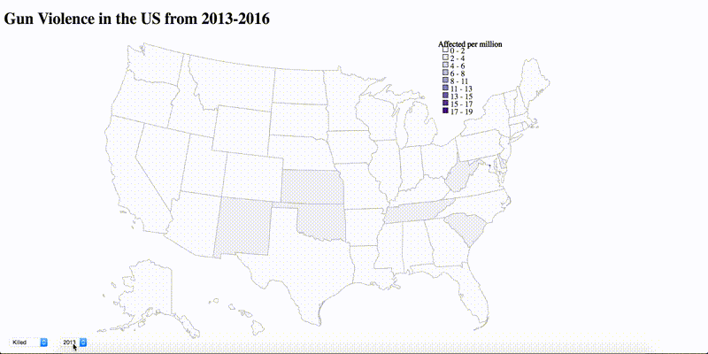
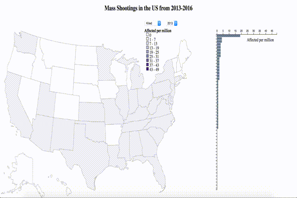

# shooting-viz

## Summary
An infographic showing the impact of mass shootings in the US over the last 4 years. It uses the data from: http://www.shootingtracker.com which shows the number of mass shootings over different states in the US from 2013 onwards. The data was downloaded and restructured to suit the indexing needs of the visualization. 

## Data File
The data file used by the visualization is `out.json` which has the following structure:

```
    year:
        state: {
                    "killed": <number>
                    "wounded": <number>
                }
```

## Design

The visualization shows a chloropleth map of the US and allows a user to explore the number of people affected(killed/wounded) by mass shootings over 4 years. Hovering over a state shows the number in million affected in that state for the selection under consideration and also highlights a bar on an accompanying bar chart. The purpose of the bar chart is to show the rank of the selected state among all states for that year and selection. Hovering over a bar will show you the name of the state that corresponds with that bar. So, for example, it is easy to know which state has the lowest/highest crime rate for a given year

- A Chloropleth was chosen as the primary visualization as it easy to observe the values across states in it
- A drop down selector was used for changing the value of the time variable as it is easy to see how values change over time
- An accompanying bar chart shows a better comparison among states for a given year. This was chosen because difference in the length of bars is more perceivable than difference in hue of color.

An introduction animation was included to highlight states with no mass shootings over the years and states with the highest number of mass shootings. This is done in the `Martini Glass` manner, starting off by guiding the user to see a particular aspect of the visualization and then allowing him to further explore on his/her own.

## See it here
http://deborah-digges.github.io/shooting-viz/index.html


## Feedback

### Person 1
&#9745; States with higher population may have a higher crime rate. Avoid confounding of the results by finding the per capita crime rate for each state

&#9745; It's difficult to compare values across states - make an accompanying horizontal bar chart(sorted)

&#9745; Allow exploring the values across the 3 years

&#9745; Encode 0 properly to show states where there are no shootings. Set the first color only for value 0 (now it is for 0-5), and if the value is 1 and more choose the next color.

### Person 2
&#9745; A single scale is probably better

&#9745; Add a proper title and the source of the data

&#9745; pack a lot of more information by using JavaScript pop-ups on click or hover.  can show the information by year for each state in a pop-up - that makes it more useful because one can see how it is changing.  Right now, it is very difficult to visualize the change in a particular state over the years

&#128504; Your legends could use some refinement - you can reduce the number of shades (I think there are too many) - 3 should be enough (representing low, average, high, based on median and quartiles) - or maybe 4 or 5 at most

### Person 3
&#9745; when we see bar presentation we cannot focus the mouse and understand, what particular state has this value. The only way to check it is to find it on the map. Implement state highlighting when the viewer focus on the particular bar, or, at least, show tooltip with the state name.

&#9745; Explore the chart by yourself and find interesting outcomes, highlight these outcomes on the project page, include your findings in README file

## Resources
1. Data source: http://www.shootingtracker.com
2. Mike Bostock's [Let's Make a Bar Chart](https://bost.ocks.org/mike/bar/)
3. [D3 collections](https://github.com/d3/d3-collection)

## Visualization before Feedback



- Not easy to compare values across years because of changing scales
- Not easy to compare values across states without bar chart
- Incorrect heading
- No Link to data source
- Not easy to find the state which has the highest or lowest crime rate for a given year

## Final Visualization


## Outcomes of the visualization

The viewer should be able to infer the following:

1. Washington D.C. was greatly affected in 2013(perhaps because of the [Washington Navy Yard Shooting](https://en.wikipedia.org/wiki/Washington_Navy_Yard_shooting))
2. Washington D.C. also has a large number of wounded people by Mass Shooting in the year 2014
3. Overall, Washington and Louisiana seem to be most affected over the years by mass shooting
4. On the other hand states like Utah and Iowa have consistently lower crime rates.

Despite being the headquarters of multiple federal law enforcement agencies, Washington D.C eventually became known as the ["murder capital" of the United States](https://en.wikipedia.org/wiki/Crime_in_Washington,_D.C.). 
